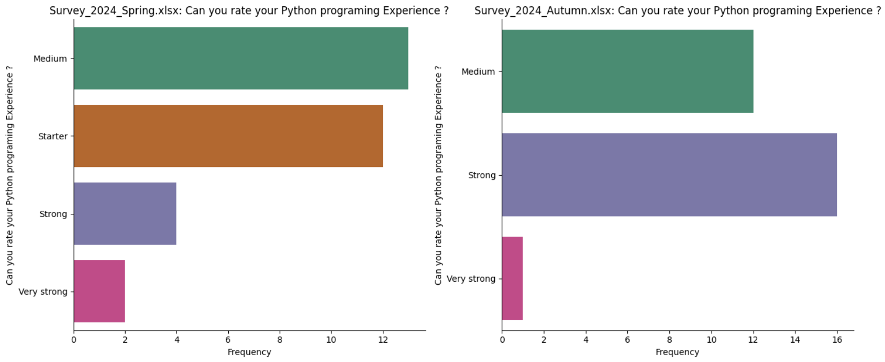

# dataScience

Python Programming Experience Survey Analysis

This project visualizes survey data collected in spring and autumn 2024, comparing respondents’ Python programming experience levels. The goal is to display consistent colors for each experience category across two bar plots, making it easy to compare distributions between surveys.

Code Summary

    •	Data Loading: Reads two Excel files (Survey_2024_Spring.xlsx, Survey_2024_Autumn.xlsx) and groups responses by experience level.
    •	Color Consistency: Extracts unique experience levels from both datasets and assigns each level a fixed color using a seaborn palette, ensuring the same color represents each category in both plots.
    •	Plotting:
    •	Creates side-by-side bar plots for the two surveys.
    •	Titles, labels, and other styling elements are added for readability.

Output Description

The output shows two bar plots, each representing the frequency of experience levels (e.g., “Medium”, “Starter”) in the spring and autumn surveys. Using consistent colors across both plots, it’s easy to compare the distribution of experience levels over time.
• Observations:
• Categories like “Medium” and “Strong” are common, while “Very Strong” has the fewest responses.
• Consistent colors allow quick comparison of experience level distributions between spring and autumn.

This visualization approach improves clarity and enables quick insights into how Python experience levels change over time.

This markdown format provides a clear, concise explanation suitable for a README file.
